<div align="center">



<br>

[](https://abirdeol.tech)
[](https://abirdeol.tech/abir-deol-resume.pdf)
[](https://linkedin.com/in/abirdeol)
[](https://abirdeol.tech/projects)

<br>


</div>

Second year computing science at the University of Alberta. I write low level systems
from scratch to find out what is underneath the abstraction: an allocator instead of
`malloc`, Raft instead of a database that already handles consensus, a rasterizer
instead of a graphics API.

None of it is better than the real thing. That was never the point. The point is that
afterwards the real thing stops being magic, so when it behaves strangely you have
somewhere to start.

<div align="center"></div>

## oracle-of-delphi

A fully local autonomous voice assistant. Sub-600ms bidirectional speech with barge-in,
OS level machine control, dual layer persistent memory over a knowledge graph, and a
WebGL holographic HUD. It boots offline with no GPU, no model download and no
credentials, then swaps in real backends behind traits.

```
oracle-audio (C++/RT)  ──shm+socket──▶  oracle-core (Rust/Tokio)  ──WS──▶  oracle-hud
   capture · VAD ·                          agent loop · memory ·
   barge-in · TTS                           connectors · gateway
                                                  │
                                          authed UDS (SO_PEERCRED)
                                                  ▼
                                        oracle-actd (Rust, privileged)
                                        policy · input · shell · audit
```

The design premise is that the model is an untrusted planner. Actuation lives in a
separate privileged daemon that recomputes the required capability from the operation
itself, gates irreversible actions behind confirmation, and audits everything.


**[github.com/apollo-2006/oracle-of-delphi](https://github.com/apollo-2006/oracle-of-delphi)** · **[try the HUD in your browser](https://apollo-2006.github.io/oracle-of-delphi/)** (scripted core; the real one needs a local GPU)

<div align="center"></div>

### upstream

Open source work on [ggml-org](https://github.com/ggml-org), the C/C++ inference stack
behind whisper.cpp and llama.cpp.

| | |
|---|---|
| **[whisper.cpp #4031](https://github.com/ggml-org/whisper.cpp/pull/4031)**  | the tests aborted on any `GGML_BACKEND_DL=ON` build: no backend registers until something calls `ggml_backend_load_all()`, so init ran with zero devices and tripped an assert. every example already made that call, the tests were the only callers that did not. [found it](https://github.com/ggml-org/whisper.cpp/issues/4030), fixed it in four call sites |
| **[whisper.cpp #4029](https://github.com/ggml-org/whisper.cpp/pull/4029)** | prebuilt macOS CLI binaries: arm64, x64, and a `lipo` fused universal archive that picks its CPU backend at load time, so one download runs on an M1 and an M4 without either giving up its instructions |
| **[whisper.cpp #4019](https://github.com/ggml-org/whisper.cpp/pull/4019)** | documented the stream example's two output formats, and the CWD relative model path that surfaces as a context init failure |
| **[llama.cpp #28261](https://github.com/ggml-org/llama.cpp/pull/28261)** | documented streaming tool call deltas and the Jinja requirement, every claim cited to file and line |

### distributed systems and storage

Every project marked **live** runs its real code in the browser: C and C++ compiled to
WebAssembly, Python under Pyodide, each built and published by CI from the repository.

| | |
|---|---|
| **[nexus_db](https://github.com/apollo-2006/nexus_db)** · [live](https://apollo-2006.github.io/nexus_db/) | embedded LSM key-value store: skip list memtable, write ahead log with crash recovery, immutable SSTables, tombstones. crash it in the demo and watch the log replay |
| **[nexus_cluster](https://github.com/apollo-2006/nexus_cluster)** · [live](https://apollo-2006.github.io/nexus_cluster/) | Raft from the paper: elections, log replication, a replicated key-value store over TCP, and a simulation that checks the safety properties at every step |
| **[nexus_editor](https://github.com/apollo-2006/nexus_editor)** · [live](https://apollo-2006.github.io/nexus_editor/) | collaborative editor on a fractional index CRDT with string positions and tombstones; three replicas converge through a delaying, reordering network |

### close to the metal

| | |
|---|---|
| **[nano_match](https://github.com/apollo-2006/nano_match)** · [live](https://apollo-2006.github.io/nano_match/) | limit order book, price time priority, no allocation after startup: 12M requests/s at a 50ns median on one core |
| **[custom_mem_alloc](https://github.com/apollo-2006/custom_mem_alloc)** · [live](https://apollo-2006.github.io/custom_mem_alloc/) | allocator over one `mmap` region: first fit, splitting, neighbour coalescing, aborts on double free, benchmarked against glibc |
| **[neon_vm](https://github.com/apollo-2006/neon_vm)** · [live](https://apollo-2006.github.io/neon_vm/) | stack based bytecode VM with bounds checked single step dispatch and a step through debugger |

### graphics

| | |
|---|---|
| **[photon_tracer](https://github.com/apollo-2006/photon_tracer)** · [live](https://apollo-2006.github.io/photon_tracer/) | path tracer with no libraries: 1080p at 50 spp in half a second on 32 threads, and on every core of your browser |
| **[cpu_rasterizer](https://github.com/apollo-2006/cpu_rasterizer)** · [live](https://apollo-2006.github.io/cpu_rasterizer/) | full 3D pipeline in plain JavaScript, no graphics API: barycentric fill, `1/w` z-buffer, 0.44 ms a frame |
| **[rasterizer_engine](https://github.com/apollo-2006/rasterizer_engine)** · [live](https://apollo-2006.github.io/rasterizer_engine/) | the same idea in C++ and SDL2: culling, flat shading and a depth buffer into a CPU framebuffer |

### tools I actually use

| | |
|---|---|
| **[thermal_monitor](https://github.com/apollo-2006/thermal_monitor)** | daemon tracking CPU load, thermal curves and VRAM clocks into a local database |
| **[terminal_dashboard](https://github.com/apollo-2006/terminal_dashboard)** | system monitor with per core CPU, memory, network and GPU telemetry |
| **[cal-cli](https://github.com/apollo-2006/cal-cli)** | macro tracking from the command line, because logging a meal should be one command |
| **points-sys** (private) | two player points economy, one HTML file, no build step, live synced |

### games and other things

| | |
|---|---|
| **[valo_scout](https://github.com/apollo-2006/valo_scout)** | valorant stat tracker |
| **[radiant_slice](https://github.com/apollo-2006/radiant_slice)** | barebones valorant style fps shooter |
| **[personal_portfolio](https://github.com/apollo-2006/personal_portfolio)** | [abirdeol.tech](https://abirdeol.tech), built from scratch |

<div align="center"></div>

### things I got wrong

Four of the projects above had a bug that cost me real hours. I wrote each one up
afterwards: the symptom, how I chased it, what was actually wrong, and what I changed
about how I write that kind of code.

- **[The block that was too small to free](https://abirdeol.tech/research/allocator)** &nbsp; an intrusive free list corrupting the block next door
- **[The delete that did not delete](https://abirdeol.tech/research/tombstones)** &nbsp; a flush optimization that resurrected deleted keys
- **[The order that was in two places](https://abirdeol.tech/research/order-pool)** &nbsp; a use after free that never crashed
- **[A cluster that could not keep a leader](https://abirdeol.tech/research/election-timeouts)** &nbsp; when the runtime pauses longer than your failure detector waits

### currently

Working through machine learning from classical computer vision upward, and
[writing down what I learn](https://abirdeol.tech/research) rather than collecting
tutorials. Two time national MMA champion, 2020 to 2024. Looking for software
engineering internships.

<div align="center">


</div>
