<div align="center">



<br>

[](https://abirdeol.tech)
[](https://abirdeol.tech/abir-deol-resume.pdf)
[](https://linkedin.com/in/abirdeol)
[](https://apollo-2006.github.io/cpu_rasterizer/)

<br>


</div>

Second year computing science at the University of Alberta. I write low level systems
from scratch to find out what is underneath the abstraction: an allocator instead of
`malloc`, Raft instead of a database that already handles consensus, a rasterizer
instead of a graphics API.

None of it is better than the real thing. That was never the point. The point is that
afterwards the real thing stops being magic, so when it behaves strangely you have
somewhere to start.

<div align="center"></div>

## oracle-of-delphi

A fully local autonomous voice assistant. Sub-600ms bidirectional speech with barge-in,
OS level machine control, dual layer persistent memory over a knowledge graph, and a
WebGL holographic HUD. It boots offline with no GPU, no model download and no
credentials, then swaps in real backends behind traits.

```
oracle-audio (C++/RT)  ──shm+socket──▶  oracle-core (Rust/Tokio)  ──WS──▶  oracle-hud
   capture · VAD ·                          agent loop · memory ·
   barge-in · TTS                           connectors · gateway
                                                  │
                                          authed UDS (SO_PEERCRED)
                                                  ▼
                                        oracle-actd (Rust, privileged)
                                        policy · input · shell · audit
```

The design premise is that the model is an untrusted planner. Actuation lives in a
separate privileged daemon that recomputes the required capability from the operation
itself, gates irreversible actions behind confirmation, and audits everything.


**[github.com/apollo-2006/oracle-of-delphi](https://github.com/apollo-2006/oracle-of-delphi)**

<div align="center"></div>

### distributed systems and storage

| | |
|---|---|
| **[nexus_db](https://github.com/apollo-2006/nexus_db)** | embedded LSM key-value store: skip list memtable, write ahead log, immutable SSTables, tombstone compaction |
| **[nexus_cluster](https://github.com/apollo-2006/nexus_cluster)** | Raft from scratch: leader election, log replication, term management, custom TCP transport |
| **[nexus_editor](https://github.com/apollo-2006/nexus_editor)** | real time collaborative editor, fractional indexing CRDT, goroutine per client |

### close to the metal

| | |
|---|---|
| **[nano_match](https://github.com/apollo-2006/nano_match)** | limit order book with price time priority and no heap allocation on the matching path |
| **[custom_mem_alloc](https://github.com/apollo-2006/custom_mem_alloc)** | thread safe allocator over one `mmap` region, intrusive free list, block recycling |
| **[neon_vm](https://github.com/apollo-2006/neon_vm)** | stack based virtual machine, bytecode chunking, its own dispatch loop |

### graphics

| | |
|---|---|
| **[cpu_rasterizer](https://github.com/apollo-2006/cpu_rasterizer)** | full 3D pipeline in plain JavaScript, no graphics API. barycentric fill, `1/w` z-buffer. **[runs in your browser](https://apollo-2006.github.io/cpu_rasterizer/)** |
| **[photon_tracer](https://github.com/apollo-2006/photon_tracer)** | raytracer with no libraries: vector math, ray generation, camera, PPM output |
| **[rasterizer_engine](https://github.com/apollo-2006/rasterizer_engine)** | software rasterizer, perspective matrices and triangle fill written out longhand |

### tools I actually use

| | |
|---|---|
| **[thermal_monitor](https://github.com/apollo-2006/thermal_monitor)** | daemon tracking CPU load, thermal curves and VRAM clocks into a local database |
| **[terminal_dashboard](https://github.com/apollo-2006/terminal_dashboard)** | system monitor with per core CPU, memory, network and GPU telemetry |
| **[cal-cli](https://github.com/apollo-2006/cal-cli)** | macro tracking from the command line, because logging a meal should be one command |
| **[points-sys](https://github.com/apollo-2006/points-sys)** | two player points economy, one HTML file, no build step, live synced |

### games and other things

| | |
|---|---|
| **[valo_scout](https://github.com/apollo-2006/valo_scout)** | valorant stat tracker |
| **[radiant_slice](https://github.com/apollo-2006/radiant_slice)** | barebones valorant style fps shooter |
| **[personal_portfolio](https://github.com/apollo-2006/personal_portfolio)** | [abirdeol.tech](https://abirdeol.tech), built from scratch |

<div align="center"></div>

### things I got wrong

Four of the projects above had a bug that cost me real hours. I wrote each one up
afterwards: the symptom, how I chased it, what was actually wrong, and what I changed
about how I write that kind of code.

- **[The block that was too small to free](https://abirdeol.tech/research/allocator)** &nbsp; an intrusive free list corrupting the block next door
- **[The delete that did not delete](https://abirdeol.tech/research/tombstones)** &nbsp; a flush optimization that resurrected deleted keys
- **[The order that was in two places](https://abirdeol.tech/research/order-pool)** &nbsp; a use after free that never crashed
- **[A cluster that could not keep a leader](https://abirdeol.tech/research/election-timeouts)** &nbsp; when the runtime pauses longer than your failure detector waits

### currently

Working through machine learning from classical computer vision upward, and
[writing down what I learn](https://abirdeol.tech/research) rather than collecting
tutorials. Two time national MMA champion, 2020 to 2024. Looking for software
engineering internships.

<div align="center">


</div>
