<div align="center">

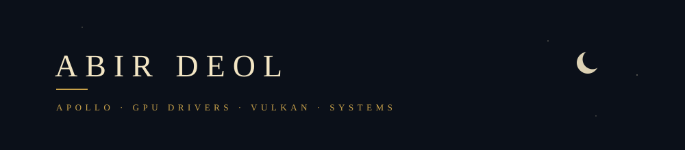

<br>

[](https://abirdeol.tech)
[](https://abirdeol.tech/abir-deol-resume.pdf)
[](https://linkedin.com/in/abirdeol)
[](https://abirdeol.tech/projects?filter=live)

</div>

Third year computing science at the University of Alberta. I write low level systems
from scratch to find out what is underneath the abstraction: an allocator instead of
`malloc`, Raft instead of a database that already handles consensus, a rasterizer
instead of a graphics API.

None of it is better than the real thing. That was never the point. The point is that
afterwards the real thing stops being magic, so when it behaves strangely you have
somewhere to start.

<div align="center"></div>

## upstream

**10 pull requests merged** into the Vulkan validation layers, whisper.cpp, llama.cpp and lemonade, and
driver bugs reported to Mesa that RADV developers have picked up. Most started as a bug I found, reported
and then fixed myself, with sanitizers, Miri or the validation layers. The badges show each one's live state,
and [abirdeol.tech/work](https://abirdeol.tech/work) has the reasoning behind each.

<table>
<tr>
<td valign="top"><a href="https://github.com/KhronosGroup/Vulkan-ValidationLayers/pull/13150"><b>Vulkan-ValidationLayers&nbsp;#13150</b></a><br><a href="https://github.com/KhronosGroup/Vulkan-ValidationLayers/pull/13150"></a></td>
<td valign="top">an application indexing its shared memory out of bounds made GPU-AV read back a word that was never a packed instruction offset, then decode it anyway and walk off an empty operand list. <a href="https://github.com/KhronosGroup/Vulkan-ValidationLayers/issues/13134">found it</a> under a real llama.cpp workload, fixed it over five review rounds</td>
</tr>
<tr>
<td valign="top"><a href="https://github.com/KhronosGroup/Vulkan-ValidationLayers/pull/13104"><b>Vulkan-ValidationLayers&nbsp;#13104</b></a><br><a href="https://github.com/KhronosGroup/Vulkan-ValidationLayers/pull/13104"></a></td>
<td valign="top">GPU-AV segfaulted <code>vkCreateComputePipelines</code> on any <code>coopMatLoad</code> or <code>coopMatStore</code> whose stride was computed at runtime, because the instrumentation pass read the stride as if it were always constant. <a href="https://github.com/KhronosGroup/Vulkan-ValidationLayers/issues/13098">found it</a>, fixed the pass</td>
</tr>
<tr>
<td valign="top"><a href="https://github.com/KhronosGroup/Vulkan-ValidationLayers/pull/13208"><b>Vulkan-ValidationLayers&nbsp;#13208</b></a><br><a href="https://github.com/KhronosGroup/Vulkan-ValidationLayers/pull/13208"></a></td>
<td valign="top">graphics pipeline libraries using independent sets were never checked for matching set layouts (06616/06617). found by running the whole suite on lavapipe, where the one test that broke the rule tripped a driver assert</td>
</tr>
<tr>
<td valign="top"><a href="https://github.com/ggml-org/llama.cpp/pull/28996"><b>llama.cpp&nbsp;#28996</b></a><br><a href="https://github.com/ggml-org/llama.cpp/pull/28996"></a></td>
<td valign="top">the Vulkan <code>im2col</code> shaders wrote through a <code>buffer_reference</code> with no declared alignment, so every store was emitted as <code>Aligned 16</code> against a 2 or 4 byte stride. <a href="https://github.com/ggml-org/llama.cpp/issues/28960">found it</a> with the validation layers, 40 VUID hits to zero</td>
</tr>
<tr>
<td valign="top"><a href="https://github.com/ggml-org/whisper.cpp/pull/4031"><b>whisper.cpp&nbsp;#4031</b></a><br><a href="https://github.com/ggml-org/whisper.cpp/pull/4031"></a></td>
<td valign="top">the tests aborted on any <code>GGML_BACKEND_DL=ON</code> build: no backend registers until something calls <code>ggml_backend_load_all()</code>, and the tests were the only callers that did not. <a href="https://github.com/ggml-org/whisper.cpp/issues/4030">found it</a>, fixed it in four call sites</td>
</tr>
<tr>
<td valign="top"><a href="https://github.com/lemonade-sdk/lemonade/pull/3601"><b>lemonade&nbsp;#3601</b></a><br><a href="https://github.com/lemonade-sdk/lemonade/pull/3601"></a></td>
<td valign="top">AMD GPUs on Linux were named by their raw KFD <code>gfx_target_version</code>, so an RX 9070 XT reported itself as <code>120001</code>. that same field keys the ROCm arch lookup, so the readable name had to be added beside it rather than replace it. <a href="https://github.com/lemonade-sdk/lemonade/issues/3592">found it</a></td>
</tr>
</table>

**Mesa.** Running the validation layers on RADV and lavapipe also turned up driver bugs. I report them on
Mesa's GitLab with the exact test, the crash site and the VUID showing the application is valid; two
already have fixes and became Vulkan CTS tickets.

- **[mesa#16396](https://gitlab.freedesktop.org/mesa/mesa/-/issues/16396)** &nbsp; the shared Vulkan runtime lowered plain descriptor heap loads as acceleration structure loads, breaking lavapipe and RADV alike. bisected to one commit, with a fix ready
- **[mesa#16378](https://gitlab.freedesktop.org/mesa/mesa/-/issues/16378)** &nbsp; RADV asserted on device destroy when two queues shared a family but differed in flags
- **[mesa#16379](https://gitlab.freedesktop.org/mesa/mesa/-/issues/16379)** &nbsp; RADV segfaulted creating a result-status-only query pool without a video profile

<details>
<summary><b>19 more pull requests</b></summary>
<br>

<table>
<tr>
<td valign="top"><a href="https://github.com/KhronosGroup/Vulkan-ValidationLayers/pull/13209"><b>Vulkan-ValidationLayers&nbsp;#13209</b></a><br><a href="https://github.com/KhronosGroup/Vulkan-ValidationLayers/pull/13209"></a></td>
<td valign="top">eleven descriptor heap tests compared a sampled UNORM value with <code>==</code>, so lavapipe failed them for being one ulp off, which the spec allows</td>
</tr>
<tr>
<td valign="top"><a href="https://github.com/KhronosGroup/Vulkan-ValidationLayers/pull/13207"><b>Vulkan-ValidationLayers&nbsp;#13207</b></a><br><a href="https://github.com/KhronosGroup/Vulkan-ValidationLayers/pull/13207"></a></td>
<td valign="top">a single-plane view of a YCbCr image that kept the whole multi-planar format was never reported (01586), and lavapipe asserted on it</td>
</tr>
<tr>
<td valign="top"><a href="https://github.com/KhronosGroup/Vulkan-ValidationLayers/pull/13217"><b>Vulkan-ValidationLayers&nbsp;#13217</b></a><br><a href="https://github.com/KhronosGroup/Vulkan-ValidationLayers/pull/13217"></a></td>
<td valign="top">five tests that only passed on one kind of driver, including an access chain that pointed at an empty heap slot: RADV silently dropped the store, lavapipe segfaulted</td>
</tr>
<tr>
<td valign="top"><a href="https://github.com/lemonade-sdk/lemonade/pull/3611"><b>lemonade&nbsp;#3611</b></a><br><a href="https://github.com/lemonade-sdk/lemonade/pull/3611"></a></td>
<td valign="top">embedding requests over 512 tokens failed with a 500 under an 8192 token context: an embedding model is non causal, so the micro batch is the real ceiling and it was left at the default. <a href="https://github.com/lemonade-sdk/lemonade/issues/3591">found it</a></td>
</tr>
<tr>
<td valign="top"><a href="https://github.com/ggml-org/whisper.cpp/pull/4064"><b>whisper.cpp&nbsp;#4064</b></a><br><a href="https://github.com/ggml-org/whisper.cpp/pull/4064"></a></td>
<td valign="top">heap out of bounds read when a VAD model declares any encoder layer count but four, reachable from <code>whisper-cli --vad</code></td>
</tr>
<tr>
<td valign="top"><a href="https://github.com/huggingface/candle/pull/3965"><b>candle&nbsp;#3965</b></a><br><a href="https://github.com/huggingface/candle/pull/3965"></a></td>
<td valign="top">heap overflow in <code>Tensor::from_raw_buffer</code>, reachable from safe code: a seven byte f32 buffer wrote past its allocation and returned <code>Ok</code></td>
</tr>
<tr>
<td valign="top"><a href="https://github.com/huggingface/candle/pull/3963"><b>candle&nbsp;#3963</b></a><br><a href="https://github.com/huggingface/candle/pull/3963"></a></td>
<td valign="top">undefined behaviour loading quantized GGML tensors, a byte slice cast to blocks with no length or alignment check</td>
</tr>
<tr>
<td valign="top"><a href="https://github.com/huggingface/tokenizers/pull/2398"><b>tokenizers&nbsp;#2398</b></a><br><a href="https://github.com/huggingface/tokenizers/pull/2398"></a></td>
<td valign="top">a malformed BPE merge list produced invalid UTF-8 through <code>from_utf8_unchecked</code>; the fix removes the unsafe block</td>
</tr>
<tr>
<td valign="top"><a href="https://github.com/espeak-ng/espeak-ng/pull/2530"><b>espeak-ng&nbsp;#2530</b></a><br><a href="https://github.com/espeak-ng/espeak-ng/pull/2530"></a></td>
<td valign="top">an unsigned subtraction read before a heap string on ordinary voice selection, on nearly every run, found under UBSan</td>
</tr>
<tr>
<td valign="top"><a href="https://github.com/espeak-ng/espeak-ng/pull/2537"><b>espeak-ng&nbsp;#2537</b></a><br><a href="https://github.com/espeak-ng/espeak-ng/pull/2537"></a></td>
<td valign="top">a zero length phoneme data file crashed the process through a NULL buffer no caller checked</td>
</tr>
<tr>
<td valign="top"><a href="https://github.com/pdf-rs/pdf/pull/296"><b>pdf-rs&nbsp;#296</b></a><br><a href="https://github.com/pdf-rs/pdf/pull/296"></a></td>
<td valign="top">a PDF declaring a function domain backwards panicked the parser</td>
</tr>
<tr>
<td valign="top"><a href="https://github.com/pdf-rs/pdf/pull/295"><b>pdf-rs&nbsp;#295</b></a><br><a href="https://github.com/pdf-rs/pdf/pull/295"></a></td>
<td valign="top">encrypted files from some producers could not be opened with any password, because <code>/P</code> was written as an unsigned 32 bit integer</td>
</tr>
<tr>
<td valign="top"><a href="https://github.com/ggml-org/llama.cpp/pull/28462"><b>llama.cpp&nbsp;#28462</b></a><br><a href="https://github.com/ggml-org/llama.cpp/pull/28462"></a></td>
<td valign="top">a release tarball unpacked inside any other git repository stamped that repository's commit into <code>--version</code></td>
</tr>
<tr>
<td valign="top"><a href="https://github.com/espeak-ng/espeak-ng/pull/2529"><b>espeak-ng&nbsp;#2529</b></a><br><a href="https://github.com/espeak-ng/espeak-ng/pull/2529"></a></td>
<td valign="top"><code>-Wimplicit-fallthrough</code> for the thousand line language table, where a missing <code>break</code> silently gives one language another's settings</td>
</tr>
<tr>
<td valign="top"><a href="https://github.com/ggml-org/whisper.cpp/pull/4047"><b>whisper.cpp&nbsp;#4047</b></a><br><a href="https://github.com/ggml-org/whisper.cpp/pull/4047"></a></td>
<td valign="top">the CI leg that would have caught #4031 before it shipped</td>
</tr>
<tr>
<td valign="top"><a href="https://github.com/ggml-org/whisper.cpp/pull/4029"><b>whisper.cpp&nbsp;#4029</b></a><br><a href="https://github.com/ggml-org/whisper.cpp/pull/4029"></a></td>
<td valign="top">prebuilt macOS binaries, including a <code>lipo</code> fused universal archive that picks its CPU backend at load time</td>
</tr>
<tr>
<td valign="top"><a href="https://github.com/ggml-org/whisper.cpp/pull/4019"><b>whisper.cpp&nbsp;#4019</b></a><br><a href="https://github.com/ggml-org/whisper.cpp/pull/4019"></a></td>
<td valign="top">documented the stream example's two output formats, and the working directory relative model path that surfaces as an init failure</td>
</tr>
<tr>
<td valign="top"><a href="https://github.com/lemonade-sdk/lemonade/pull/3652"><b>lemonade&nbsp;#3652</b></a><br><a href="https://github.com/lemonade-sdk/lemonade/pull/3652"></a></td>
<td valign="top">the GUI3 web app shipped with no tab icon and two 404s on every page load</td>
</tr>
<tr>
<td valign="top"><a href="https://github.com/lemonade-sdk/llamacpp-rocm/pull/145"><b>llamacpp-rocm&nbsp;#145</b></a><br><a href="https://github.com/lemonade-sdk/llamacpp-rocm/pull/145"></a></td>
<td valign="top">every nightly ROCm build of llama-server reported build 1, because a shallow clone makes <code>git rev-list --count</code> return 1</td>
</tr>
</table>

</details>

<div align="center"></div>

## oracle-of-delphi

A fully local autonomous voice assistant. Sub-600ms bidirectional speech with barge-in,
OS level machine control, dual layer persistent memory over a knowledge graph, and a
WebGL holographic HUD. It boots offline with no GPU, no model download and no
credentials, then swaps in real backends behind traits.

```
oracle-audio (C++/RT)  ──shm+socket──▶  oracle-core (Rust/Tokio)  ──WS──▶  oracle-hud
   capture · VAD ·                          agent loop · memory ·
   barge-in · TTS                           connectors · gateway
                                                  │
                                          authed UDS (SO_PEERCRED)
                                                  ▼
                                        oracle-actd (Rust, privileged)
                                        policy · input · shell · audit
```

The design premise is that the model is an untrusted planner. Actuation lives in a
separate privileged daemon that recomputes the required capability from the operation
itself, gates irreversible actions behind confirmation, and audits everything.


**[github.com/apollo-2006/oracle-of-delphi](https://github.com/apollo-2006/oracle-of-delphi)** · **[try the HUD in your browser](https://apollo-2006.github.io/oracle-of-delphi/)** (scripted core; the real one needs a local GPU)

<div align="center"></div>

## live demos

Every demo runs the project's own code in your browser: C and C++ compiled to WebAssembly, Python under
Pyodide, TypeScript and JavaScript as written. GitHub Actions builds each one from its repository and
publishes it to Pages.

<table>
<tr>
<td width="50%" valign="top">
<a href="https://apollo-2006.github.io/nexus_cluster/">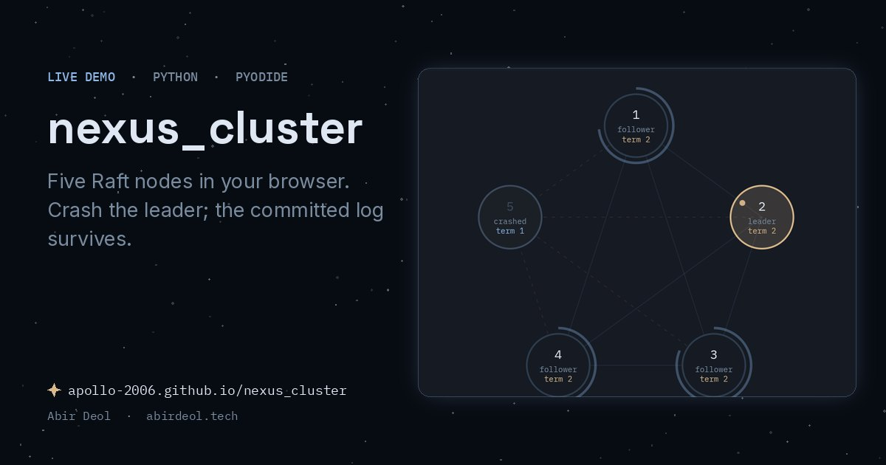</a>
<br><b><a href="https://github.com/apollo-2006/nexus_cluster">nexus_cluster</a></b><br>
Raft from the paper, with a simulation that checks the safety properties at every step
</td>
<td width="50%" valign="top">
<a href="https://apollo-2006.github.io/nano_match/">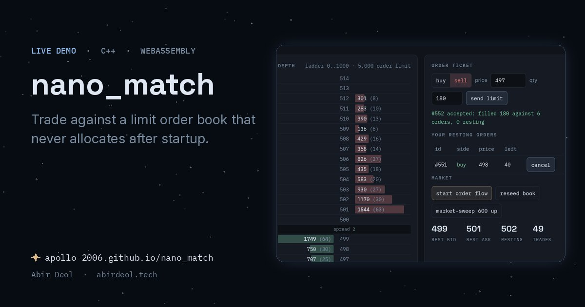</a>
<br><b><a href="https://github.com/apollo-2006/nano_match">nano_match</a></b><br>
limit order book, no allocation after startup: 12M requests/s at a 50ns median on one core
</td>
</tr>
<tr>
<td width="50%" valign="top">
<a href="https://apollo-2006.github.io/photon_tracer/">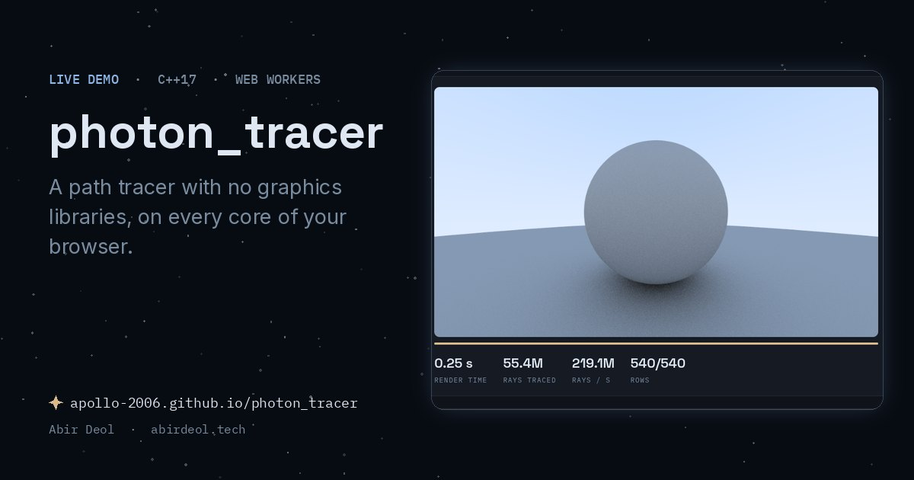</a>
<br><b><a href="https://github.com/apollo-2006/photon_tracer">photon_tracer</a></b><br>
path tracer with no libraries: 1080p at 50 spp in half a second on 32 threads
</td>
<td width="50%" valign="top">
<a href="https://apollo-2006.github.io/nexus_db/">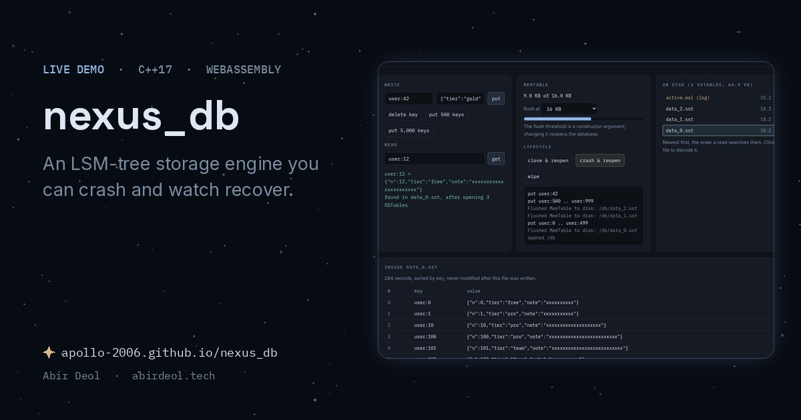</a>
<br><b><a href="https://github.com/apollo-2006/nexus_db">nexus_db</a></b><br>
LSM key value store: skip list memtable, write ahead log, SSTables and tombstones
</td>
</tr>
</table>

<details>
<summary><b>6 more demos</b></summary>
<br>

<table>
<tr>
<td width="50%" valign="top">
<a href="https://apollo-2006.github.io/oracle-of-delphi/">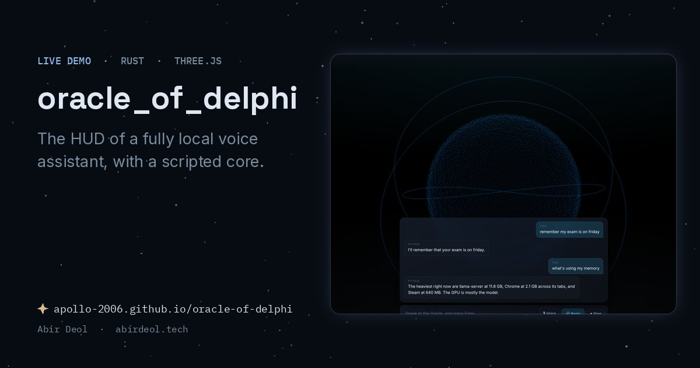</a>
<br><b><a href="https://github.com/apollo-2006/oracle-of-delphi">oracle-of-delphi</a></b><br>
the real HUD of the assistant above, with a scripted core standing in for the local GPU
</td>
<td width="50%" valign="top">
<a href="https://apollo-2006.github.io/nexus_editor/">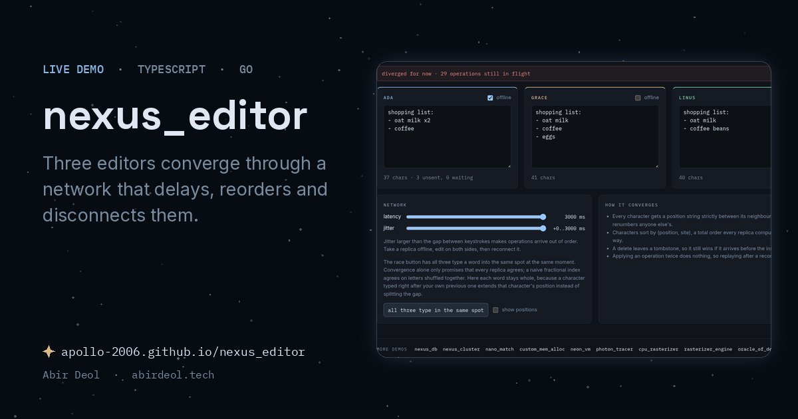</a>
<br><b><a href="https://github.com/apollo-2006/nexus_editor">nexus_editor</a></b><br>
collaborative editing on a fractional index CRDT with string positions and tombstones
</td>
</tr>
<tr>
<td width="50%" valign="top">
<a href="https://apollo-2006.github.io/custom_mem_alloc/">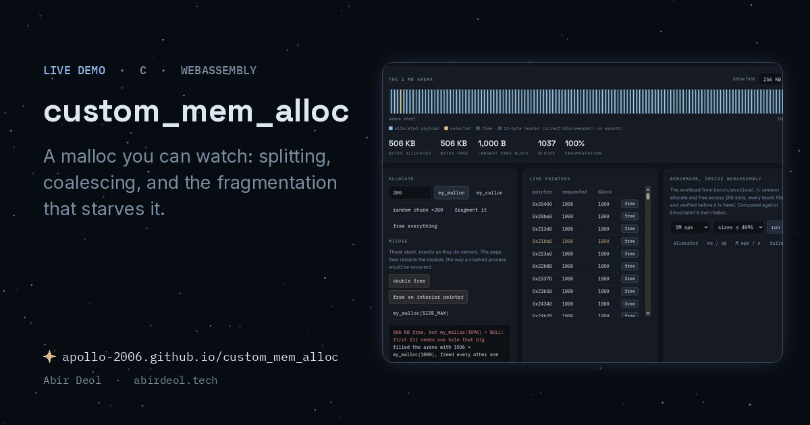</a>
<br><b><a href="https://github.com/apollo-2006/custom_mem_alloc">custom_mem_alloc</a></b><br>
allocator over one <code>mmap</code> region: first fit, splitting, neighbour coalescing, benchmarked against glibc
</td>
<td width="50%" valign="top">
<a href="https://apollo-2006.github.io/neon_vm/">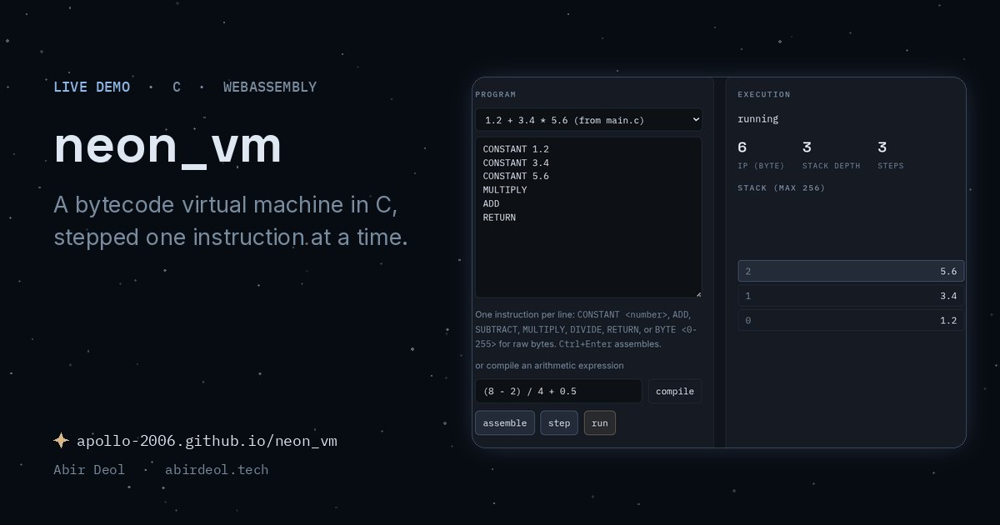</a>
<br><b><a href="https://github.com/apollo-2006/neon_vm">neon_vm</a></b><br>
stack based bytecode VM with bounds checked single step dispatch and a step through debugger
</td>
</tr>
<tr>
<td width="50%" valign="top">
<a href="https://apollo-2006.github.io/cpu_rasterizer/">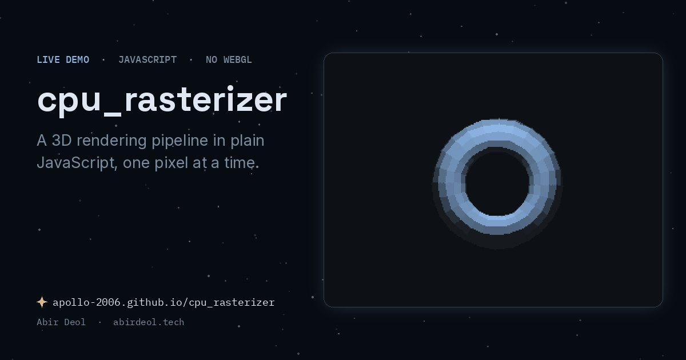</a>
<br><b><a href="https://github.com/apollo-2006/cpu_rasterizer">cpu_rasterizer</a></b><br>
a full 3D pipeline in plain JavaScript with no graphics API, 0.43 ms a frame
</td>
<td width="50%" valign="top">
<a href="https://apollo-2006.github.io/rasterizer_engine/">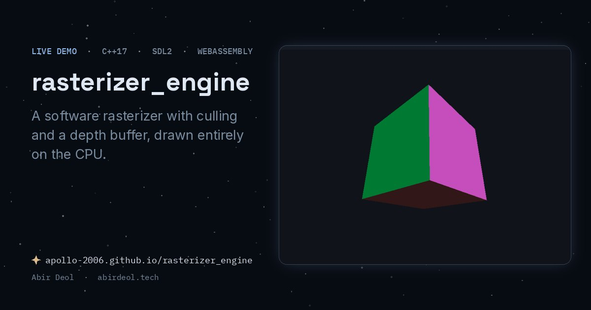</a>
<br><b><a href="https://github.com/apollo-2006/rasterizer_engine">rasterizer_engine</a></b><br>
the same idea in C++ and SDL2: culling, flat shading and a depth buffer on the CPU
</td>
</tr>
</table>

</details>

<div align="center"></div>

### things I got wrong

Four of the projects above had a bug that cost me real hours. I wrote each one up
afterwards: the symptom, how I chased it, what was actually wrong, and what I changed
about how I write that kind of code.

- **[The block that was too small to free](https://abirdeol.tech/research/allocator)** &nbsp; an intrusive free list corrupting the block next door
- **[The delete that did not delete](https://abirdeol.tech/research/tombstones)** &nbsp; a flush optimization that resurrected deleted keys
- **[The order that was in two places](https://abirdeol.tech/research/order-pool)** &nbsp; a use after free that never crashed
- **[A cluster that could not keep a leader](https://abirdeol.tech/research/election-timeouts)** &nbsp; when the runtime pauses longer than your failure detector waits

### smaller things

- **[thermal_monitor](https://github.com/apollo-2006/thermal_monitor)** &nbsp; terminal daemon logging CPU load, package temperature and memory to SQLite twice a second
- **[terminal_dashboard](https://github.com/apollo-2006/terminal_dashboard)** &nbsp; terminal system monitor with live AMD GPU sensors on Windows and Linux
- **[cal-cli](https://github.com/apollo-2006/cal-cli)** &nbsp; macro tracking from the command line, because logging a meal should be one command
- **[valo_scout](https://github.com/apollo-2006/valo_scout)** &nbsp; Valorant match analyzer, ranking games on combat and utility with a hand written heapsort
- **[radiant_slice](https://github.com/apollo-2006/radiant_slice)** &nbsp; tactical FPS systems in Unreal Engine 5 C++: counter strafing, spray patterns, lag compensation

### currently

Working through machine learning from classical computer vision upward, and
[writing down what I learn](https://abirdeol.tech/research) rather than collecting
tutorials. Two time national MMA champion, 2020 to 2024. Looking for software
engineering internships.
